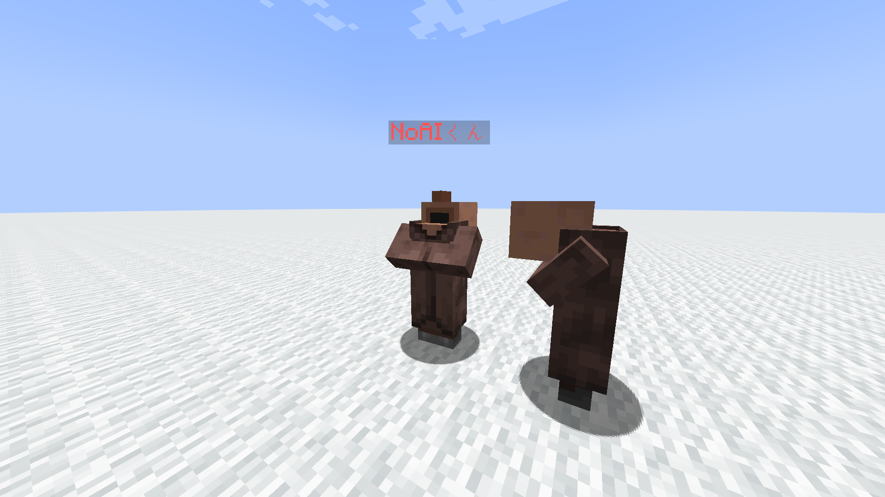

# Custom-Talk-Villager

# 村人の見た目、NoAI、Silent、Invulnerable、チーム、交易、名前、会話内容などを設定できるデータパック

## 対応バージョン Minecraft Java Edition 1.19.3

配布用に改良しました。\
使用には装置が必要になります。\
元々刑務所用で制作した為、チーム名は刑務所用です。[load.mcfunction](Custom_Talk_Villager/data/custom_talk_villager/functions/load.mcfunction)にチーム、スコア設定があります。


> TEAM_NAME：TEAM Color
```md
Prisoner：red  // 囚人
Jailer：aqua   // 看守
Officer：blue  // 職員
Other：gray    // その他
```
> SCORE_NAME  
```
ctv
ctv_pages
ctv_talk_UUID
ctv_talk_no
ctv_warped_rc
ctv_facing
```

チーム設定は必要に応じて変更してください。\
スコアはいじると壊れます。

# 設置方法
① 装置を設置したい場所に立ちます。\
② 次のコマンドを実行します。
```
/function custom_talk_villager:a_set
```
③ 完成です。無限に村人を作りましょう。

# 設置範囲について

プレイヤーを基準に前後左右1マスずつ、更にボタンや看板などの関係上、正面のみ2マス分の範囲が必要です。


実際に設置した画像です。縦は3マスあれば大丈夫です。


コマンドを実行するとプレイヤーの向いている方向に向かって、装置が設置されます。\
ちょうど上の画像のような感じです。\
設置後プレイヤーはtpで装置外に放り出され、装置の方向に180度回転します。

# 装置の使い方


装置の左の看板「新規村人作成」を押すと上の画像のようになります。\
ある程度は分かると思いますが、分かりにくい点だけ解説していきます。


交易内容を設定するにはチェストの中にアイテムを入れます。\
アイテムは縦に見ていきます。\
例えば上の画像では丸石一個でリンゴが交換できるようになります。\
また、オークの木材3つと木の棒2つで木のツルハシが交換というようにbuyに2つのアイテムを設定できます。


村人に適用するには右側の看板「情報更新」を押す必要があります。\
交易アイテムは名前やタグなどNBTを入れる事ができます。\
チェストのスロット数から交易の最大個数は9つです。きっと充分でしょう。\


名前のテキストに装飾したい時は/data mergeなどで看板の文字を装飾しましょう。\
そして村人の設定を更新するときは必ず情報更新ボタンを押してくださいね。

# 村人の召喚方法

左下のボタンを押すと歪んだキノコ付きの棒が手に入ります。\
アイテムの説明欄には設定した村人の名前が入ります。\
あとはこれを好きな場所で右クリックするだけです。\
あなたの望んだ村人が舞い降りてくることでしょう。

# 会話の設定方法
まず会話を設定できるのはteam Jailer(看守)だけなのでそこは注意しましょう。\
村人の会話を変更するにはこのコマンドを実行して看守チームに入ります。
```
/team join Jailer
```
会話は本と羽ペンに書いていきます。

今回は1ページ目に「1番目の会話」、2ページ目に「2番目の会話」のように3ページ目まで用意しました。\
ではこれを持って先程のテストくんに右クリックしてみます。


その瞬間倒れた愛しの村人を見るかも知れませんが、きっと気の所為です。


右クリックする度、先程の本の1ページ目から順番に会話が表示されます。\
限界など挑戦したことありませんが、もう会話の文字制限に苦しむことはないでしょう。

会話は一番近くの村人の情報を参照します。例えばテストくん１とテストくん２が居たとして、テストくん２が一番近くにいる状態でテストくん１に話しかけても、答えてくれるのはテストくん２です。伝わってるといいですね。

他の村人に話しかけることで話しかけた回数はリセットされます。\
また話しかけた回数はそれぞれのプレイヤーで管理されます。


# 重要な仕様と既知の不具合

## 最低レベル
レベルの設定が1のままだと職業が上手く設定されない問題があります。直し方がよく分からないので、応急処置として **設定レベルが1の時は2に引き上げる** 仕様にしてあります。最低レベルは2ですよ？レベルが1、もしくは設定していない場合は自動で2になりますからね、分かりましたね？

## 就職する問題
あぁ、えぇと。就活が成功することは素晴らしいことなんですが、定職に就かないことが大事な子もいますよね。基本的に求職者は就職します。これはもうNoAIをONにする、もしくは職業ブロックを置かないしかないです。

## 情報更新を押さなかった場合

村人の職業を設定し、情報更新をせずにボタンを押した場合は、その職業の村人が本来持っている交易内容が表示されます。\
特に意図して作った訳ではないのですが、これはこれで使えるのでね。\
ただし、情報更新を押さないと名前やチームなどは設定されませんからね。\
この機能を使いたい時は職業以外のすべての情報を更新した後、職業を設定し、情報更新を押さずにボタンを押しましょう。

## NoAIの向く方向

NoAIに設定した場合、村人は右クリックした時にプレイヤーが向いていた向きを引き継ぎます。\
うまく表示されない時はワールドを再読み込みしてみてくださいね。

## 会話変更後に引き継ぐ情報
本と羽ペンを右クリックして新たな村人がこの世に降り立った時、彼が引き継いだ情報は以下です。
- チーム
- 職業
- タイプ
- 交易内容
- Invulnerable
- NoAI
- Silent
- 名前
- Rotation
- 位置

## 装置を２つ設置したら？
前の装置は使えなくなります。\
ただ、看板のコマンドなどは成功するので、新しい場所に設置したのなら大人しく前の装置を壊しましょう。\
同時に存在していいのは1つまでなのです。

# 不具合報告・質問

何か文句がありましたら、私のツイッターまで来てください。村人バトルしましょう。

[**Twitter @meanoniwa**](https://twitter.com/meanoniwa)
-
[**YouTube**](https://www.youtube.com/@meanoniwa)
-
---
Custom Talk Villager Ver.1.0